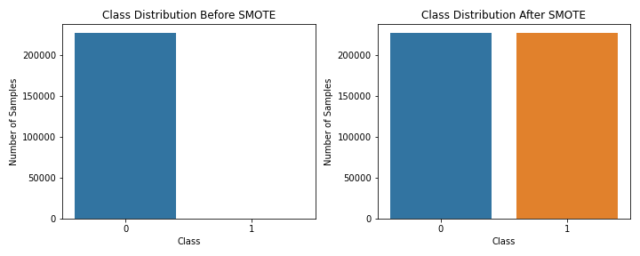
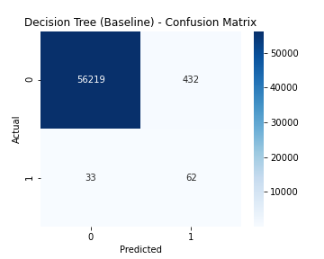
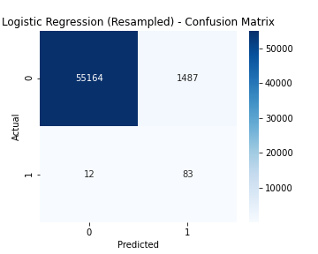
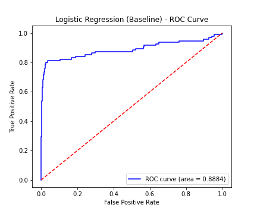
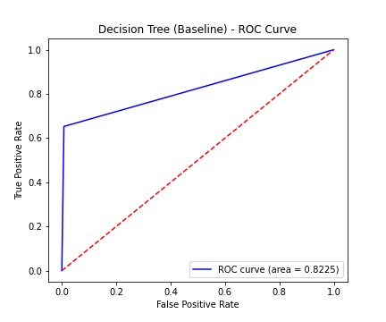
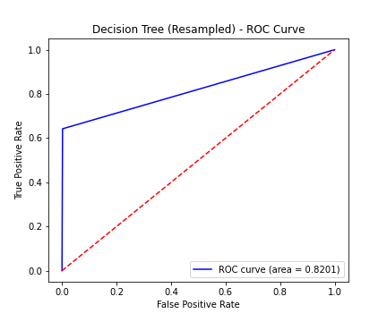

# Credit Card Fraud Detection: A Machine Learning Approach for Financial Institutions

**Student:** Riché FLEURINORD  
**Program:** Data Science & AI – First Cohort (2025)  
**Project:** Machine Learning Fundamentals – Phase 3  
**GitHub Repository:** https://github.com/richefleuriord/Ds_Fraud_Detection_Project.git 

**Instructors:** Wedter JEROME & Geovany Batista Polo LAGUERRE  
**Submission Deadline:** August 17, 2025  

---

## Overview
This project analyzes credit card transaction data to help financial institutions detect fraudulent transactions. By applying data preprocessing, visualization, and machine learning models, we aim to provide actionable insights that minimize financial losses and improve fraud prevention strategies. Key focus areas include transaction amount, time patterns, and PCA-transformed features associated with fraudulent activity.

---

## Business Understanding
Credit card fraud causes significant financial losses and undermines customer trust. Detecting fraud in real time is essential for financial institutions.  

**Business Problem:**  
How can financial institutions identify potentially fraudulent credit card transactions using historical transaction data?  

**Stakeholders:**  
- Banks and credit card companies aiming to reduce losses.  
- Risk management and fraud detection teams seeking actionable monitoring insights.  
- Customers benefiting from improved security and reduced fraudulent charges.  

**Objectives:**  
- Build predictive models to classify transactions as fraudulent or non-fraudulent.  
- Identify key features contributing to fraud detection.  
- Provide actionable recommendations for fraud prevention.  

**Business Impact:**  
Accurate fraud detection saves financial institutions millions, improves operational efficiency, and enhances customer trust.

---

## Data Understanding
The dataset (`creditcard.csv`) contains **284,807 transactions** collected over two days in September 2013 from European cardholders, including **492 fraudulent transactions** (0.172%), highlighting extreme class imbalance.  

**Features:**  
- `V1–V28`: PCA-transformed anonymized transaction features.  
- `Time`: Seconds elapsed since the first transaction.  
- `Amount`: Transaction amount in euros.  
- `Class`: Target variable (1 = fraud, 0 = non-fraud).  

**Key Characteristics:**  
- Numerical features only, no missing values.  
- 1,081 duplicate entries removed during preprocessing.  
- Class imbalance addressed using **SMOTE** to improve minority class learning.

**Stakeholder Audience:**  
Financial institutions and fraud prevention teams benefit from this analysis, as the dataset provides sufficient transactions and features to train models capable of detecting rare fraudulent activities.

---

## Modeling
We trained and compared four machine learning models:  

1. **Baseline Models (Original Dataset)**  
   - Logistic Regression  
   - Decision Tree  

2. **Resampled Models (SMOTE applied)**  
   - Logistic Regression  
   - Decision Tree  

**Data Preparation Steps:**  
- Removed duplicates.  
- Scaled numerical features using `StandardScaler`.  
- Split dataset into training and testing sets (80/20).  
- Applied SMOTE to handle class imbalance. 

 

**Modeling Goal:**  
Maximize the detection of fraudulent transactions while maintaining reasonable precision and minimizing false positives.

---

## Evaluation
Performance metrics beyond accuracy were used to assess the models due to class imbalance: precision, recall, F1-score, and ROC-AUC.  

**confusion matrix**

**RO0-AUC / curve**

**Comparative Summary of Key Metrics:**

| Model                        | Accuracy | Precision (Fraud) | Recall (Fraud) | F1-Score (Fraud) | ROC-AUC |
|-------------------------------|---------|-----------------|---------------|-----------------|---------|
| Logistic Regression (Baseline)| 0.9119  | 0.0152          | 0.8105        | 0.0299          | 0.8884  |
| Decision Tree (Baseline)      | 0.9918  | 0.1255          | 0.6526        | 0.2105          | 0.8225  |
| Logistic Regression (Resampled)| 0.9736 | 0.0529          | 0.8737        | 0.0997          | 0.9626  |
| Decision Tree (Resampled)     | 0.9974  | 0.3526          | 0.6421        | 0.4552          | 0.8201  |

**Insights:**  
- Baseline models achieve high overall accuracy but fail to detect most frauds.  
- Resampled models improve recall and ROC-AUC, showing better fraud detection.  
- Decision Tree (Resampled) provides the best balance between recall and precision for practical deployment.

---

## Conclusion
Handling class imbalance and thorough data preprocessing are crucial in fraud detection. Resampling using SMOTE significantly improves model performance for rare fraudulent transactions. The Decision Tree trained on resampled data is selected as the final model due to its superior ability to identify fraud with minimal false positives.

---

## Business Recommendations
1. **Implement Real-Time Fraud Detection System**  
   Deploy the model into transaction processing systems to flag potential fraud in real time.  

2. **Continuously Update and Retrain the Model**  
   Periodically retrain the model with new transaction data to adapt to evolving fraud patterns.  

3. **Enhance Risk Management with Tiered Monitoring**  
   Categorize transactions into low, medium, and high risk using predicted probabilities for proactive monitoring.

---

## Next Steps
- Integrate the model into live payment systems.  
- Collect new transaction data and retrain the model regularly.  
- Incorporate additional features (e.g., customer behavior, geolocation, device fingerprints) to improve predictive performance.  
- Develop a dashboard for real-time fraud alerts and monitoring metrics.

**Notes:**  
- The `Data` folder contains the main dataset (`creditcard.csv`), tracked with **Git Large File Storage (LFS)**.  
- `.ipynb_checkpoints` is automatically generated by Jupyter Notebook for saving temporary progress.  
- `images` folder contains plots, graphs, and figures used in reports or presentations.  
- `Final.ipynb` is the main notebook with all coding, data analysis, and model building steps.  
- `Final_Presentation.*` files are for presenting the project to instructors or stakeholders.  
- `README.md` provides the project summary, methodology, and instructions to replicate the work. 

**Infos**
richefleurinord20@gmail.com 

